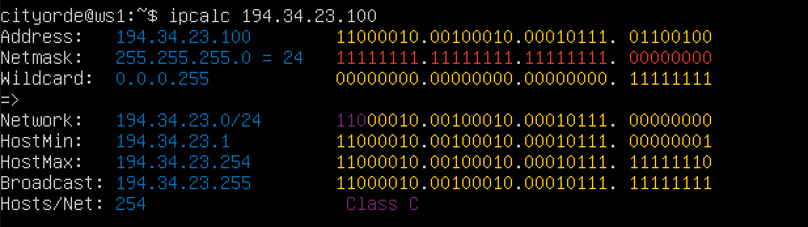
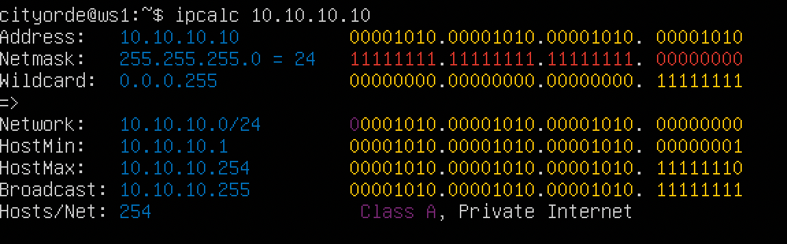
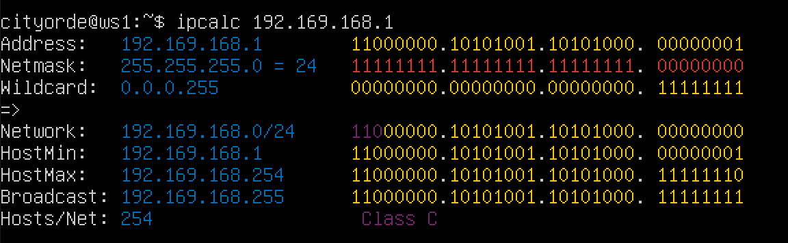

## Part 1. Инструмент ipcalc

Поднимаем виртуальную машину ws1

#### 1.1. Сети и маски

1) Определяем адрес сети 192.167.38.54/13

2) Перевод маски 255.255.255.0 в префиксную и двоичную запись

Перевод /15 в обычную и двоичную запись

Перевод 11111111.11111111.11111111.11110000 в обычную и префиксную запись: 

Обычная - 255.255.255.240

Префиксная - /28

3) Минимальный и максимальный хост в сети 12.167.38.4 при масках: 

/8

11111111.11111111.00000000.00000000

255.255.254.0

/4

#### 1.2. localhost

Определить и записать в отчёт, можно ли обратиться к приложению, работающему на localhost, со следующими IP:

194.34.23.100 - нельзя

127.0.0.2 - можно

127.1.0.1 - можно

128.0.0.1 - нельзя

#### 1.3. Диапазоны и сегменты сетей

Определить и записать в отчёт:

1) какие из перечисленных IP можно использовать в качестве публичного, а какие только в качестве частных: 

10.0.0.45 - частный

134.43.0.2 - публичный

192.168.4.2 - частный

172.20.250.4 - частный

172.0.2.1 - публичный

192.172.0.1 - публичный

172.68.0.2 - публичный

172.16.255.255 - частный

10.10.10.10 - частный

192.169.168.1 - публичный

2) какие из перечисленных IP адресов шлюза возможны у сети 10.10.0.0/18:

10.0.0.1 - невозможен

10.10.0.2 - возможен

10.10.10.10 - возможен

10.10.100.1 - невозможен

10.10.1.255 - возможен

## Part 2. Статическая маршрутизация между двумя машинами

Поднять две виртуальные машины (далее -- ws1 и ws2)

С помощью команды ip a посмотреть существующие сетевые интерфейсы

Описать сетевой интерфейс, соответствующий внутренней сети, на обеих машинах и задать следующие адреса и маски: ws1 - 192.168.100.10, маска /16, ws2 - 172.24.116.8, маска /12

Выполнить команду netplan apply для перезапуска сервиса сети

#### 2.1. Добавление статического маршрута вручную

Добавить статический маршрут от одной машины до другой и обратно при помощи команды вида ip r add

Пропинговать соединение между машинами

## 2.2. Добавление статического маршрута с сохранением

Перезапустить машины

Добавить статический маршрут от одной машины до другой с помощью файла etc/netplan/00-installer-config.yaml

Пропинговать соединение между машинами

## Part 3. Утилита iperf3

#### 3.1. Скорость соединения

Перевести и записать в отчёт: 8 Mbps в MB/s, 100 MB/s в Kbps, 1 Gbps в Mbps

8Mbps = 1MBps

100MBps = 819200Kbps

1Gbps = 1024Mbps

#### 3.2. Утилита iperf3

Измерить скорость соединения между ws1 и ws2

## Part 4. Сетевой экран

#### 4.1. Утилита iptables

Создать файл /etc/firewall.sh, имитирующий фаерволл, на ws1 и ws2

Запустить файлы на обеих машинах командами chmod +x /etc/firewall.sh и /etc/firewall.sh

    Код для фильтрации пакетов организован в виде набора таблиц, каждая из которых предназначена для конкретной цели. 
    Таблица состоит из группы предопределённых цепочек содержащих правила, которые проверяются по очереди.

    Каждое правило состоит из условий и действия. 
    Действие применяется к пакету,n если все условия выполнены.

    Правила iptables в firewall.sh добавляются последовательно. 
    Если условие подходит, то сразу выполняется действиe (ACCEPT или DROP). 
    Срабатывает ПЕРВОЕ правило.

    ws1 первым правилом отклоняет пакеты imcp. Пакеты от ws1 не возвращаются.

    ws2 первым правилом разрешает пакеты imcp. Пакеты от ws2 приходят.

#### 4.2. Утилита nmap

Командой ping найти машину, которая не "пингуется", после чего утилитой nmap показать, что хост машины запущен
Проверка: в выводе nmap должно быть сказано: Host is up

## Part 5. Статическая маршрутизация сети

Сеть:

Поднять пять виртуальных машин (3 рабочие станции (ws11, ws21, ws22) и 2 роутера (r1, r2))

#### 5.1. Настройка адресов машин

Настроить конфигурации машин в etc/netplan/00-installer-config.yaml согласно сети на рисунке.

Перезапустить сервис сети. Если ошибок нет, то командой ip -4 a проверить, что адрес машины задан верно. 

Также пропинговать ws22 с ws21. Аналогично пропинговать r1 с ws11.

#### 5.2. Включение переадресации IP-адресов.

Для включения переадресации IP, выполните команду на роутерах:
sysctl -w net.ipv4.ip_forward=1
При таком подходе переадресация не будет работать после перезагрузки системы.

Откройте файл /etc/sysctl.conf и добавьте в него следующую строку:
net.ipv4.ip_forward = 1
При использовании этого подхода, IP-переадресация включена на постоянной основе.

#### 5.3. Установка маршрута по-умолчанию

Пример вывода команды ip r после добавления шлюза:

    default via 10.10.0.1 dev eth0
    10.10.0.0/18 dev eth0 proto kernel scope link src 10.10.0.2

Настроить маршрут по-умолчанию (шлюз) для рабочих станций. Для этого добавить default перед IP роутера в файле конфигураций

Вызвать ip r и показать, что добавился маршрут в таблицу маршрутизации

Пропинговать с ws11 роутер r2 и показать на r2, что пинг доходит. Для этого использовать команду:
tcpdump -tn -i eth1

#### 5.4. Добавление статических маршрутов

Добавить в роутеры r1 и r2 статические маршруты в файле конфигураций

Вызвать ip r и показать таблицы с маршрутами на обоих роутерах

Запустить команды на ws11:
ip r list 10.10.0.0/18 и ip r list 0.0.0.0/0

В отчёте объяснить, почему для адреса 10.10.0.0/18 был выбран маршрут, отличный от 0.0.0.0/0, хотя он попадает под маршрут по-умолчанию:

    Маршрут по умолчанию выполняется в случае отсутствия других подходящих в netplan.
    Для адреса 10.10.0.0 был выбран маршрут, отличный от 0.0.0.0/0, 
    потому что маска /18 описывает маршрут к сети.

#### 5.5. Построение списка маршрутизаторов

Запустить на r1 команду дампа:
tcpdump -tnv -i eth0

При помощи утилиты traceroute построить список маршрутизаторов на пути от ws11 до ws21

    Команда traceroute  отправляет пакет с TTL (time to live - время жизни,
    указывает максимальное количество маршрутизаторов, которое может быть пройдено пакетом.)
    и показывает адрес порта ответившего об исчерпании TTL, на каждом следующем шаге
    TTL увеличивается на единицу пока не достигнет целевого адреса.

    Первый пакет отправляется с TTL, равным 1, и поэтому первый же маршрутизатор
    возвращает обратно сообщение ICMP, указывающее на невозможность доставки данных.

    Затем traceroute повторяет отправку пакета, но уже с TTL, равным 2,
    что позволяет первому маршрутизатору пропустить пакет дальше.

    Процесс повторяется до тех пор, пока при определённом
    значении TTL пакет не достигнет целевого узла.

    При получении ответа от этого узла процесс трассировки считается завершённым.

#### 5.6. Использование протокола ICMP при маршрутизации

Запустить на r1 перехват сетевого трафика, проходящего через eth0 с помощью команды:
tcpdump -n -i eth0 icmp

Пропинговать с ws11 несуществующий IP (например, 10.30.0.111) с помощью команды:
ping -c 1 10.30.0.111

## Part 6. Динамическая настройка IP с помощью DHCP

Для r2 настроить в файле /etc/dhcp/dhcpd.conf конфигурацию службы DHCP:

1) указать адрес маршрутизатора по-умолчанию, DNS-сервер и адрес внутренней сети. 

2) в файле resolv.conf прописать nameserver 8.8.8.8.

Перезагрузить службу DHCP командой systemctl restart isc-dhcp-server. 

Машину ws21 перезагрузить при помощи reboot и через ip a показать, что она получила адрес.

Также пропинговать ws22 с ws21.

Указать MAC адрес у ws11, для этого в etc/netplan/00-installer-config.yaml надо добавить строки: macaddress: 10:10:10:10:10:BA, dhcp4: true

Для r1 настроить аналогично r2, но сделать выдачу адресов с жесткой привязкой к MAC-адресу (ws11). 

Провести аналогичные тесты

Запросить с ws21 обновление ip адреса

## Part 7. NAT

В файле /etc/apache2/ports.conf на ws22 и r1 изменить строку Listen 80 на Listen 0.0.0.0:80, то есть сделать сервер Apache2 общедоступным

Запустить веб-сервер Apache командой service apache2 start на ws22 и r1

Добавить в фаервол, созданный по аналогии с фаерволом из Части 4, на r2 следующие правила:

    1) Удаление правил в таблице filter - iptables -F
    2) Удаление правил в таблице "NAT" - iptables -F -t nat
    3) Отбрасывать все маршрутизируемые пакеты - iptables --policy FORWARD DROP

Запускать файл также, как в Части 4

Проверить соединение между ws22 и r1 командой ping

При запуске файла с этими правилами, ws22 не должна "пинговаться" с r1

Добавить в файл ещё одно правило:

    4) Разрешить маршрутизацию всех пакетов протокола ICMP

Запускать файл также, как в Части 4

Проверить соединение между ws22 и r1 командой ping

При запуске файла с этими правилами, ws22 должна "пинговаться" с r1

Добавить в файл ещё два правила:

    5) Включить SNAT, а именно маскирование всех локальных ip из локальной сети, 
    находящейся за r2 (по обозначениям из Части 5 - сеть 10.20.0.0)

    6) Включить DNAT на 8080 порт машины r2 и добавить к веб-серверу Apache, 
    запущенному на ws22, доступ извне сети

Запускать файл также, как в Части 4

Проверить соединение по TCP для SNAT, для этого с ws22 подключиться к серверу Apache на r1 командой:
telnet [адрес] [порт]

Проверить соединение по TCP для DNAT, для этого с r1 подключиться к серверу Apache на ws22 командой telnet (обращаться по адресу r2 и порту 8080)

## Part 8. Дополнительно. Знакомство с SSH Tunnels

Запустить на r2 фаервол с правилами из Части 7

Запустить веб-сервер Apache на ws22 только на localhost

Воспользоваться Local TCP forwarding с ws21 до ws22, чтобы получить доступ к веб-серверу на ws22 с ws21

    Чтобы создать локальную переадресацию портов, передайте -L параметр ssh клиенту:
    ssh -L [LOCAL_IP:]LOCAL_PORT:DESTINATION:DESTINATION_PORT [USER@]SSH_SERVER

Проверка подключения

Воспользоваться Remote TCP forwarding c ws11 до ws22, чтобы получить доступ к веб-серверу на ws22 с ws11

    Для создания удаленной переадресации портов передайте -R параметр ssh клиенту:
    ssh -R [REMOTE:]REMOTE_PORT:DESTINATION:DESTINATION_PORT [USER@]SSH_SERVER

Проверка подключения

